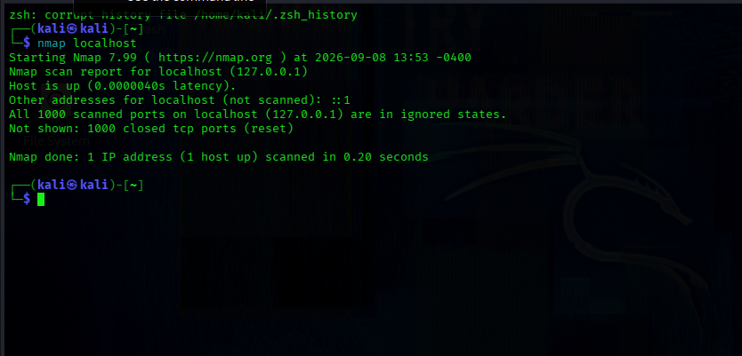
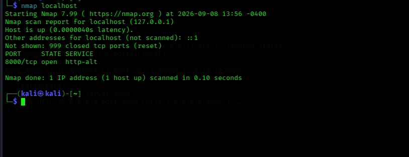
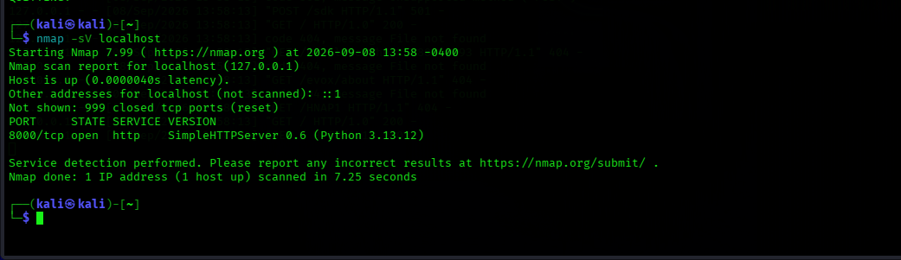

# 🔎 **Nmap Network Scanning & Service Enumeration Lab**

A beginner cybersecurity lab demonstrating network scanning, open-port identification, and service/version enumeration using Nmap in a controlled Kali Linux environment.

> ⚠️ **Ethical Use:** This project was performed only against my own local laboratory system (`127.0.0.1`). No unauthorized systems or networks were scanned.

## 🎯 **Objective**

The objective of this project was to understand how network scanners can identify open ports and determine which services are running on a system.

## 🧪 **Lab Environment**

| Component | Details |
|---|---|
| Operating System | Kali Linux |
| Virtualization | VirtualBox |
| Security Tool | Nmap 7.99 |
| Target | Localhost (`127.0.0.1`) |
| Test Service | Python HTTP Server |
| Python Version | 3.13.12 |

## 🛠️ **Tools Used**

- Kali Linux
- Nmap
- Python 3
- VirtualBox
- Linux Terminal

## 🔬 **Methodology**

### **1. Initial Network Scan**

First, I scanned the local Kali system using:

`nmap localhost`

The initial scan found no open ports among Nmap's default 1,000 TCP ports.

### **2. Started a Test Web Server**

I started a simple HTTP server on TCP port 8000:

`python3 -m http.server 8000`

This created a controlled test service on my own machine.

### **3. Scanned for Open Ports**

I performed another scan:

`nmap localhost`

Nmap detected:

`8000/tcp open http-alt`

This demonstrated how an active network service can expose a listening port.

### **4. Service and Version Detection**

I then used:

`nmap -sV localhost`

Nmap identified the service as:

`8000/tcp open http SimpleHTTPServer 0.6 (Python 3.13.12)`

### **5. Saved the Scan Results**

The results were saved using:

`nmap -sV localhost -oN scan-results.txt`

## 📊 **Findings**

### **Initial Scan**

- Host was reachable.
- 1,000 default TCP ports were scanned.
- No open ports were detected.

### **After Starting the Web Server**

- TCP port **8000** became open.
- Nmap identified the service as HTTP.
- Service/version detection identified Python's `SimpleHTTPServer`.

This demonstrated the relationship between an active service and an open network port.

## 🛡️ **Security Analysis**

An open port indicates that a service is accepting network connections.

In a real production environment, unnecessary services should be disabled or properly secured because exposed services can increase the system's attack surface.

This laboratory demonstrated the importance of:

- Identifying exposed services
- Understanding open ports
- Checking running service versions
- Reviewing unnecessary network services
- Performing security testing only with authorization

## 📸 **Screenshots**

### **1. Initial Localhost Scan**



### **2. Open Port Detection**



### **3. Service & Version Detection**



## 📁 **Project Files**

```text
Nmap-Network-Scanning-Lab/
├── README.md
├── scan-results.txt
├── 01-basic-localhost-scan.png
├── 02-open-port-scan.png
└── 03-service-version-detection.png
